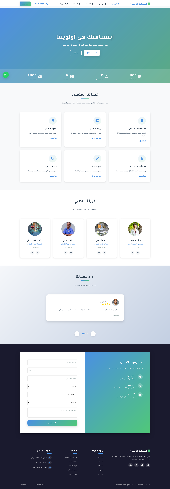

مشروع موقع عيادة ابتسامة الأسنان

هذا الملف يحتوي على شرح مفصل وكامل لمشروع موقع "عيادة ابتسامة الأسنان"، بما في ذلك الهيكلية البرمجية، المميزات، وشرح للكود وتوزيع الملفات.

هذا رابط الموقع للتجربه

https://ali-al-ahjari.github.io/Modern-Dental-Clinic-Location/

---

1. مقدمة المشروع

موقع "عيادة ابتسامة الأسنان" هو موقع ويب تعريفي لعيادة أسنان، يهدف إلى عرض خدمات العيادة، الطاقم الطبي، وآراء العملاء، بالإضافة إلى توفير وسيلة سهلة لحجز المواعيد عبر الإنترنت. الموقع مصمم ليكون متجاوباً (Responsive) مع جميع الأجهزة (الموبايل، التابلت، والكمبيوتر).

---

2. المميزات التقنية

يتمتع المشروع بالمميزات التالية:

تصميم متجاوب (Responsive Design): يعمل العرض بشكل ممتاز على الشاشات الصغيرة والكبيرة بفضل استخدام CSS Media Queries.

تفاعل المستخدم (Interactivity): استخدام JavaScript لإضافة حركات تفاعلية وسلايدر (Slider) للصور وآراء العملاء.

حجز المواعيد: نموذج حجز متكامل مع التحقق من صحة البيانات (Form Validation).

أيقونات متجهة: استخدام مكتبة Font Awesome للأيقونات.

خطوط عربية: استخدام خط "Tajawal" من Google Fonts لضمان مظهر عربي حديث وجذاب.

تأثيرات حركية (Animations): ظهور العناصر عند التمرير (Scroll Animations).

سهولة التواصل: أزرار عائمة للتواصل عبر واتساب والعودة للأعلى.

---

3. هيكلية المشروع (File Structure)

يتكون المشروع من المجلدات والملفات التالية:

موقع عيادة اسنان/
│
├── index.html          # الصفحة الرئيسية
├── about.html          # صفحة من نحن
├── services.html       # صفحة الخدمات
├── blog.html           # صفحة المدونة
├── contact.html        # صفحة اتصل بنا
│
├── css/                # مجلد ملفات التنسيق
│   ├── style.css       # التنسيقات الأساسية
│   ├── responsive.css  # تنسيقات التجاوب مع الشاشات
│   └── animations.css  # تنسيقات الحركات
│
├── js/                 # مجلد ملفات الجافاسكريبت
│   ├── main.js         # الكود الرئيسي للموقع
│   ├── booking.js      # كود خاص بنظام الحجز
│   └── gallery.js      # كود خاص بمعرض الصور
│
├── images/             # مجلد الصور المستخدمة في الموقع
└── assets/             # ملفات إضافية (مثل أيقونة الموقع)

---

4. شرح الصفحات والمكونات

أ. الصفحة الرئيسية (index.html)

هي واجهة الموقع وتحتوي على عدة أقسام:

1. شريط التنقل (Navbar): يحتوي على الروابط وزر الحجز وقائمة الموبايل.

2. القسم الرئيسي (Hero Section): سلايدر صور مع عبارات ترحيبية وأزرار دعوة لاتخاذ إجراء (CTA).

3. الاحصائيات: عدادات متحركة تظهر عدد المرضى والأطباء وسنوات الخبرة.

4. خدماتنا: عرض مختصر لأهم الخدمات.

5. الفريق الطبي: بطاقات تعريفية للأطباء.

6. آراء العملاء: سلايدر يعرض تقييمات المرضى.

7. نموذج الحجز: لحجز موعد مباشرة.

8. الفوتر (Footer): روابط سريعة ومعلومات الاتصال.

ب. ملفات التنسيق (CSS)

style.css: يحتوي على المتغيرات (الألوان، الخطوط) والتنسيقات العامة لجميع العناصر.

responsive.css: يتولى تعديل الأحجام والترتيب عند فتح الموقع من الموبايل.

animations.css: يحتوي على تعريفات keyframes للحركات مثل slide-up و fade-in.

ج. ملفات الجافاسكريبت (JS)

main.js: هو العقل المدبر للموقع، ويقوم بـ:

تهيئة القائمة المتنقلة (Mobile Menu).

تشغيل عدادات الأرقام عند الوصول إليها.

تشغيل سلايدر آراء العملاء.

تفعيل زر "العودة للأعلى".

التعامل مع النوافذ المنبثقة (Modals).

---

📸 معرض صور المشروع

5. كيفية التعديل والاستخدام

1. تغيير النصوص: يمكنك فتح ملفات .html وتعديل النصوص العربية مباشرة.

2. تغيير الصور: استبدل الصور في مجلد images أو عدل روابط الصور في ملفات HTML (حالياً يتم استخدام صور من Unsplash).

3. تغيير الألوان: افتح css/style.css وعدل متغيرات الألوان في الأعلى:

:root {
  --primary-color: #2e86de; /* اللون الأساسي */
  --secondary-color: #54a0ff; /* اللون الثانوي */
}

---

الخاتمة

هذا المشروع يمثل أساساً قوياً لموقع عيادة متكامل، قابل للتطوير بسهولة لإضافة لوحة تحكم أو ربطه بقاعدة بيانات مستقبلاً.

___
___

Dental Smile Clinic Website Project

This file contains a detailed and complete explanation of the “Dental Smile Clinic” website project, including the code structure, features, code explanation, and file distribution.

Website link for testing

https://ali-al-ahjari.github.io/Modern-Dental-Clinic-Location/

---

1. Project Introduction

The “Dental Smile Clinic” website is an informational website for a dental clinic. It aims to showcase the clinic’s services, medical staff, and customer reviews, in addition to providing an easy way to book appointments online. The site is designed to be responsive (Responsive) across all devices (mobile, tablet, and desktop).

---

2. Technical Features

The project includes the following features:

Responsive Design: The layout works perfectly on small and large screens thanks to CSS Media Queries.

User Interactivity: Using JavaScript to add interactive animations and a (Slider) for images and customer reviews.

Appointment Booking: A complete booking form with data validation (Form Validation).

Vector Icons: Using the Font Awesome library for icons.

Arabic Fonts: Using the “Tajawal” font from Google Fonts to ensure a modern and attractive Arabic look.

Animations: Elements appear on scroll (Scroll Animations).

Easy Communication: Floating buttons for WhatsApp contact and back-to-top.

---

3. Project Structure (File Structure)

The project consists of the following folders and files:

Dental Clinic Website/
│
├── index.html          # Home page
├── about.html          # About us page
├── services.html       # Services page
├── blog.html           # Blog page
├── contact.html        # Contact us page
│
├── css/                # Styling files folder
│   ├── style.css       # Base styles
│   ├── responsive.css  # Responsive styles
│   └── animations.css  # Animation styles
│
├── js/                 # JavaScript files folder
│   ├── main.js         # Main site code
│   ├── booking.js      # Booking system code
│   └── gallery.js      # Gallery code
│
├── images/             # Images used in the site
└── assets/             # Additional files (such as the site icon)

---

4. Pages and Components Explanation

A. Home Page (index.html)

This is the main interface of the website and contains several sections:

1. Navigation Bar (Navbar): Contains links, a booking button, and a mobile menu.

2. Hero Section: An image slider with welcome messages and call-to-action (CTA) buttons.

3. Statistics: Animated counters showing the number of patients, doctors, and years of experience.

4. Our Services: A brief display of the most important services.

5. Medical Team: Profile cards for doctors.

6. Customer Reviews: A slider showing patient ratings.

7. Booking Form: For booking an appointment directly.

8. Footer: Quick links and contact information.

B. Styling Files (CSS)

style.css: Contains variables (colors, fonts) and general styling for all elements.

responsive.css: Adjusts sizes and layout when the site is opened on mobile.

animations.css: Contains keyframes definitions for animations like slide-up and fade-in.

C. JavaScript Files (JS)

main.js: The site’s main logic, and it handles:

Initializing the mobile menu (Mobile Menu).

Running number counters when they are reached.

Running the customer reviews slider.

Activating the “Back to Top” button.

Handling pop-up windows (Modals).

---

📸 Project Gallery

5. How to Edit and Use

1. Change text: You can open the .html files and edit the Arabic text directly.

2. Change images: Replace images in the images folder or edit image links in the HTML files (currently using images from Unsplash).

3. Change colors: Open css/style.css and edit the color variables at the top:

:root {
  --primary-color: #2e86de; /* Primary color */
  --secondary-color: #54a0ff; /* Secondary color */
}

---

Conclusion

This project represents a strong foundation for a complete clinic website, and it can be easily extended by adding an admin dashboard or connecting it to a database in the future.

